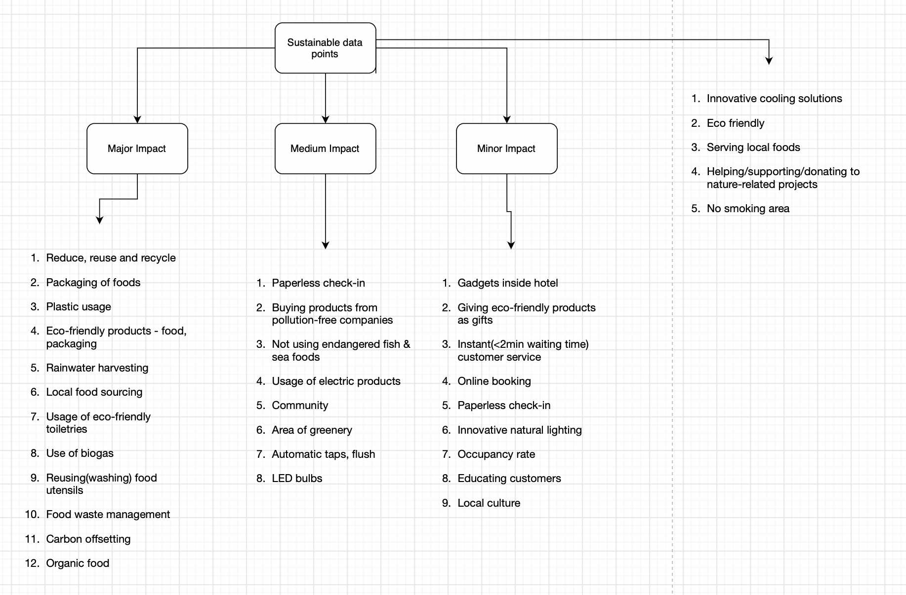

# Sustainable Hotel Booking

A easy-to-understandable green score which combines over 30+ data points, uses ML to provide personalized green score.

## Problem Statement

1. According to 2021 study, 81% of people survey said they plan to choose sustainable accommodation in future.
2. 1/3rd of Hilton guests research on environmental & social practices.
3. A 2020 booking.com survey found that 53% of respondents want to travel sustainably in near future.
4. No/very few platforms providing details of sustainability of hotels.
5. No way to know how sustainable a hotel is.

## How it works

1. Analysed and shortlisted the most used data points by Hotels to determine how sustainable the hotels are.
2. I have classified them in the high, medium and low impact bucket based on the weightage.
3. Take the input from traveler to get their personal preferences like Vegan,...(may be good to add some more examples).
4. Feed the data points received from Hotels and input taken from traveler to the custom built algorithm.
5. Compare the result of algorithm with ML model and generate the green score.
6. Display in Travel agency/hotel .. platform in a easy-to understandable way for the user.

**Usage:**
Can be integrated into existing solutions such as Amadeus APIs, or client services such as TripAdvisor, Trivago.

## Data points

## Green IT
1. **Svelte:** lightweight(4kb), easy to use, less time to code, modular
2. **pnpm:** faster, consumes less disk space, 
3. **Astro:** Zero-JS framework(Initial load), fast builds, less time to code
4. **Tailwind CSS:** Avoids cascading of CSS and HTML files, builds CSS for only the classes used
5. **Javascript:** Consumes less energy, (15 times less than Python Lang, 5 times less than TypeScript).

## Resources
1. https://medium.com/codex/what-are-the-greenest-programming-languages-e738774b1957
2. https://buildingenergyscore.energy.gov/publications/energy_savings_hotels.pdf

## Slides

[Slides](/Sustainable Hotel Booking.pptx)
